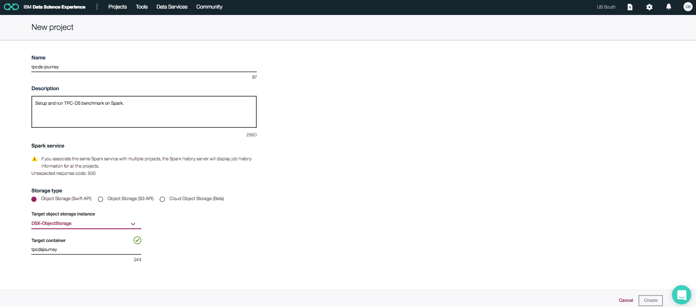

# Explore Spark SQL and its performance using TPC-DS workload

# Overview
[Apache Spark](https://spark.apache.org) is a popular distributed data processing engine that is built around speed, ease of use and a sophisticated analytics, with APIs in Java, Scala, Python, R, and SQL. Like other data processing engines, Spark has a unified optimization engine that computes the optimal way to execute a workload with the main purpose of reducing the disk IO and CPU usage.   
We can evaluate and measure the performance of Spark SQL using TPC-DS benchmark. [TPC-DS](http://www.tpc.org/tpcds) is a widely used industry standard decision support benchmark that is used to evaluate performance of the data processing engines. Given TPC-DS excercises some key data warehouse features, running TPC-DS successfully reflects the readiness of spark in terms of addressing the need of a data warehouse application. Apache Spark v2.0 supports all the ninty nine decision support queries that is part of this benchmark.

This journey is aimed at helping spark developers to quickly setup and run the TPC-DS benchmark in their
development setup. When the reader has completed this journey, they will understand the following:

* How to setup the TPC-DS toolkit 
* How to generate TPC-DS datasets at different scale factor 
* How to create Spark database artifacts 
* How to run TPC-DS benchmark queries on Spark in local mode and see the results 
* Things to consider when increasing the data scale and run against a spark cluster 

There are two modes of excercising this journey:
* By using a simple interactive command line shell script
* By using a Jupyter notebook run in IBM Data Science Experience (DSX) on IBM Bluemix


# Quick Start

## Running from command line.

### Setup
#### Development Tools
Make sure the required development tools are installed in your platform. This journey is supported on Mac and Linux
platforms only.
* **Ubuntu:** ``` sudo apt-get install gcc make flex bison byacc git ```
* **CentOS/RHEL:** ``` sudo yum install gcc make flex bison byacc git ```
* **MacOS:** ``` xcode-select --install ```

#### Journey Repository
As one of first step users need to clone the journey repository into their workstation.  After cloning the repository all the scripts, query templates, toolkit source code will be available under ```<clone_dir>/tpcds_journey``` directory. The directory ```<clone_dir>/tpcds_journey``` will be referred to as ```<tpcds_journey_root>``` through-out this README.

``` 
git clone https://github.com/SparkTC/tpcds-journey <clone_dir> 
```
##### **Example:**
```
git clone https://github.com/SparkTC/tpcds-journey /Users/john
```
After running the above command in the example, all the scripts will be available under ```/Users/john/tpcds-journey```. In this example, the directory ```/Users/john/tpcds-journey``` will be referred to as _TPCDS_JOURNEY_ROOT_ . The driver script is called tpcdsspark.sh and will be located under ```/Users/john/tpcds-journey/bin``` folder. 

#### Installation of Spark
If you have an existing spark installation that you want to use in this journey, then you need to modify ```<TPCDS_JOURNEY_ROOT>/bin/tpcdsenv.sh``` to set 
SPARK_HOME pointing to your spark installation directory. One thing to note is that, this journey requires that the spark is configured to work with a persistent metastore. In other words, your spark instalation should have been pre-configured to work with hive metastore. If you do not have an existing spark installation
then you can download and build using the [instructions](https://spark.apache.org/docs/latest/building-spark.html). Please make sure to build spark with hive support 
by following ```Building With Hive and JDBC Support``` section.

**Note:** Verify that the <TPCDS_JOURNEY_ROOT>/bin/tpcdsenv.sh has the SPARK_HOME setup correctly.
 
### Running the script
Now that we have Spark setup and the TPCDS scripts with us, we are ready to setup and start running the TPC-DS queries using the tpcdsspark.sh utility script in ```<TPCDS_JOURNEY_ROOT>/bin``` This script is the driver script and it will let you compile the TPC-DS toolkit to produce the data and the queries and run them and collect results.  

```
 $ cd ```<TPCDS_JOURNEY_ROOT>```
 $ bin/tpcdsspark.sh 

==============================================
TPC-DS On Spark Menu
----------------------------------------------
SETUP
 (1) Compile TPC-DS toolkit
 (2) Generate TPC-DS data with 1GB scale
 (3) Create spark tables
 (4) Generate TPC-DS queries
RUN
 (5) Run a subset of TPC-DS queries
 (6) Run All (99) TPC-DS Queries
CLEANUP
 (7) Cleanup toolkit
 (Q) Quit
----------------------------------------------
Please enter your choice followed by [ENTER]: 
```
### Option (1) - Compile TPC-DS toolkit
The most recent toolkit can be downloaded from http://www.tpc.org/tpcds/. To make it easier for users a toolkit
based on 2.4 is already made available to the script. The source code of this toolkit is available under ```src/toolkit```
folder. This option compiles the toolkit to produce the data generation(dsdgen) and query generation binaries(dsqgen). Below is the screen-shot when this option is choosen.

```
==============================================
TPC-DS On Spark Menu
----------------------------------------------
SETUP
 (1) Compile TPC-DS toolkit
 (2) Generate TPC-DS data with 1GB scale
 (3) Create spark tables
 (4) Generate TPC-DS queries
RUN
 (5) Run a subset of TPC-DS queries
 (6) Run All (99) TPC-DS Queries
CLEANUP
 (7) Cleanup toolkit
 (Q) Quit
----------------------------------------------
Please enter your choice followed by [ENTER]: 1
----------------------------------------------

INFO: Starting to compile..
INFO: make OS=MACOS
INFO: Completed building toolkit successfully..
Press any key to continue
```

### Option (2) - Generate TPC-DS data with 1GB scale
This option uses the data generation binary produced in option-1 to generate the test data at 1GB scale factor. The data
is generated in TPCDS_GENDATA_DIR. The default location of TPCDS_GENDATA_DIR is ```<TPCDS_JOURNEY_ROOT>/gendata```. This can be changed my modifying tpcdsenv.sh located in the ```<TPCDS_JOURNEY_ROOT>/bin```. Techically this option can be used to generate data at different scale. However since this journey is targetted towards developer environment, the scale has been fixed at 1GB. This script can be modified to generate data at a different scale factor and is discussed in ```scaling upto 100TB``` section. Below is the screenshot.

```
==============================================
TPC-DS On Spark Menu
----------------------------------------------
SETUP
 (1) Compile TPC-DS toolkit
 (2) Generate TPC-DS data with 1GB scale
 (3) Create spark tables
 (4) Generate TPC-DS queries
RUN
 (5) Run a subset of TPC-DS queries
 (6) Run All (99) TPC-DS Queries
CLEANUP
 (7) Cleanup toolkit
 (Q) Quit
----------------------------------------------
Please enter your choice followed by [ENTER]: 2
----------------------------------------------

INFO: Starting to generate data. Will take a few minutes ...
INFO: Progress : [########################################] 100%
INFO: TPCDS data is generated successfully at <TPCDS_JOURNEY_ROOT>/gendata
Press any key to continue
``` 

### Option (3) - Create Spark Tables
After the generation of data in option-2, this option creates the tables under database specified in TPCDS_DBNAME
variable in ```bin/tpcdsenv.sh```. By default TPCDS_DBNAME assumes the value of ```TPCDS``` and can be changed
by users as required. The sql statements to create the tables can be found at ```<TPCDS_JOURNEY_ROOT>/src/ddl/create_tables.sql```. The tables are created in parquet format.  Below is the screenshot.

```
==============================================
TPC-DS On Spark Menu
----------------------------------------------
SETUP
 (1) Compile TPC-DS toolkit
 (2) Generate TPC-DS data with 1GB scale
 (3) Create spark tables
 (4) Generate TPC-DS queries
RUN
 (5) Run a subset of TPC-DS queries
 (6) Run All (99) TPC-DS Queries
CLEANUP
 (7) Cleanup toolkit
 (Q) Quit
----------------------------------------------
Please enter your choice followed by [ENTER]: 3
----------------------------------------------

INFO: Creating tables. Will take a few minutes ...
INFO: Progress : [########################################] 100%
INFO: Spark tables created successfully..
Press any key to continue
```

### Option (4) - Generate TPC-DS queries
This option uses the query generation binary (dsqgen) produced in option-1 to generate the 99 TPC-DS queries. The queries are generated in TPCDS_GEN_QUERIES_DIR. The default location of TPCDS_GENDATA_DIR is ```<TPCDS_JOURNEY_ROOT>/genqueries```. This can be changed my modifying tpcdsenv.sh located in the ```<TPCDS_JOURNEY_ROOT>/bin```. Below is the screenshot.

```
==============================================
TPC-DS On Spark Menu
----------------------------------------------
SETUP
 (1) Compile TPC-DS toolkit
 (2) Generate TPC-DS data with 1GB scale
 (3) Create spark tables
 (4) Generate TPC-DS queries
RUN
 (5) Run a subset of TPC-DS queries
 (6) Run All (99) TPC-DS Queries
CLEANUP
 (7) Cleanup toolkit
 (Q) Quit
----------------------------------------------
Please enter your choice followed by [ENTER]: 4
----------------------------------------------

INFO: Generating TPC-DS qualification queries.
INFO: Completed generating TPC-DS qualification queries.
Press any key to continue
```
 
### Option (5) - Run a subset of TPC-DS queries
A comma separated list of queries can be specified in this option. The result of each query in the supplied list is generated in TPCDS_WORK_DIR. The format of the result file is query<number>.res. One summary file ```run_summary.txt``` is also made available that has information about query number, execution time and number of rows returned. 

Note:  The query number is a two digit number, so if you run query 1 , the results will be in query01.res
Note:  If you are debugging and running queries using this option, make sure to save your run_summary.txt for each of your runs

```
==============================================
TPC-DS On Spark Menu
----------------------------------------------
SETUP
 (1) Compile TPC-DS toolkit
 (2) Generate TPC-DS data with 1GB scale
 (3) Create spark tables
 (4) Generate TPC-DS queries
RUN
 (5) Run a subset of TPC-DS queries
 (6) Run All (99) TPC-DS Queries
CLEANUP
 (7) Cleanup toolkit
 (Q) Quit
----------------------------------------------
Please enter your choice followed by [ENTER]: 5
----------------------------------------------

Enter a comma separated list of queries to run (ex: 1, 2), followed by [ENTER]:
1,2
INFO: Checking pre-reqs for running TPC-DS queries. May take a few seconds..
INFO: Checking pre-reqs for running TPC-DS queries is successful.
INFO: Running TPCDS queries. Will take a few minutes depending upon the number of queries specified.. 
INFO: Progress : [########################################] 100%
INFO: TPCDS queries ran successfully. Below are the result details
INFO: Individual result files: <TPCDS_JOURNEY_ROOT>/work/query<number>.res
INFO: Summary file: <TPCDS_JOURNEY_ROOT>/work/run_summary.txt
Press any key to continue
```
### Option (6) - Run all (99) TPC-DS queries
The only difference between this option and option-5 is that all 99 TPC-DS queries are run instead of a subset.
Note: If you are running this on your laptop, it can take a few hours to run all the 99 TPC-DS queries.

```
==============================================
TPC-DS On Spark Menu
----------------------------------------------
SETUP
 (1) Compile TPC-DS toolkit
 (2) Generate TPC-DS data with 1GB scale
 (3) Create spark tables
 (4) Generate TPC-DS queries
RUN
 (5) Run a subset of TPC-DS queries
 (6) Run All (99) TPC-DS Queries
CLEANUP
 (7) Cleanup toolkit
 (Q) Quit
----------------------------------------------
Please enter your choice followed by [ENTER]: 6
----------------------------------------------
INFO: Checking pre-reqs for running TPC-DS queries. May take a few seconds..
INFO: Checking pre-reqs for running TPC-DS queries is successful.
INFO: Running TPCDS queries. Will take a few minutes depending upon the number of queries specified.. 
INFO: Progress : [########################################] 100%
INFO: TPCDS queries ran successfully. Below are the result details
INFO: Individual result files: <TPCDS_JOURNEY_ROOT>/work/query<number>.res
INFO: Summary file: <TPCDS_JOURNEY_ROOT>/work/run_summary.txt
Press any key to continue
```

### Option (7) - Cleanup toolkit
This will cleanup all the files generated during setup steps 1, 2, 3, 4. If you use this option, make sure to run the setup steps ( 1, 2, 3, 4) before running queries using option (5, 6)

### Option (Q) - Quit
This will exit the script

## Running using Notebook.
### Steps

Follow these steps to setup and run this developer journey. These steps are described in detail below.

1. [Sign up for the Data Science Experience](#1-sign-up-for-the-data-science-experience)
2. [Create the notebook](#2-create-the-notebook)
3. [Run the notebook](#3-run-the-notebook)
4. [Save and Share](#4-save-and-share)

### 1. Sign up for the Data Science Experience

Sign up for IBM's [Data Science Experience](http://datascience.ibm.com/). By signing up for the Data Science Experience, two services: ``DSX-Spark`` and ``DSX-ObjectStore`` will be created in your Bluemix account. If these services do not exist, or if you are already using them for some other application, you will need to create new instances.

To create these services:
* Login to your [Bluemix](http://bluemix.net) account.
* Create your Spark service by selecting the service type [Apache Spark](https://console.bluemix.net/catalog/services/apache-spark). If not already used, name your service ``DSX-Spark``. 
* Create your Object Storage service by selecting the service type [Cloud Object Storage](https://console.bluemix.net/catalog/infrastructure/object-storage-group). If not already used, name your service ``DSX-ObjectStorage``.

> Note: When creating your Object Storage service, select the ``Swift`` storage type in order to avoid having to pay an upgrade fee.

Take note of your service names as you will need to select them in the following steps.

### 2. Create the notebook

First you must create a new Project:
* From the [IBM Data Science Experience page](https://apsportal.ibm.com/analytics) either click the ``Get Started`` tab at the top or scroll down to ``Recently updated projects``.
* Click on ``New project`` under ``Recently updated projects``.
* Enter a ``Name`` and optional ``Description``. 
* For ``Spark Service``, select your Apache Spark service name.
* For ``Storage Type``, select the ``Object Storage (Swift API)`` option.
* For ``Target Object Storage Instance``, select your Object Storage service name.
* Click ``Create``.



Create the Notebook:
* Click on your project to open up the project details panel.
* Click ``add notebooks``.
* Click the tab for ``From URL`` and enter a ``Name`` and optional ``Description``.
* For ``Notebook URL`` enter: https://github.com/IBM/SystemML_Usage/blob/master/notebooks/Machine-Learning-Using-Apache-SystemML.ipynb
* For ``Spark Service``, select your Apache Spark service name.
* Click ``Create Notebook``.


### 3. Run the notebook

When a notebook is executed, what is actually happening is that each code cell in
the notebook is executed, in order, from top to bottom.

Each code cell is selectable and is preceded by a tag in the left margin. The tag
format is `In [x]:`. Depending on the state of the notebook, the `x` can be:

* A blank, this indicates that the cell has never been executed.
* A number, this number represents the relative order this code step was executed.
* A `*`, this indicates that the cell is currently executing.

There are several ways to execute the code cells in your notebook:

* One cell at a time.
  * Select the cell, and then press the `Play` button in the toolbar.
* Batch mode, in sequential order.
  * From the `Cell` menu bar, there are several options available. For example, you
    can `Run All` cells in your notebook, or you can `Run All Below`, that will
    start executing from the first cell under the currently selected cell, and then
    continue executing all cells that follow.
* At a scheduled time.
  * Press the `Schedule` button located in the top right section of your notebook
    panel. Here you can schedule your notebook to be executed once at some future
    time, or repeatedly at your specified interval.

### 4. Save and Share

#### How to save your work:

Under the `File` menu, there are several ways to save your notebook:

* `Save` will simply save the current state of your notebook, without any version
  information.
* `Save Version` will save your current state of your notebook with a version tag
  that contains a date and time stamp. Up to 10 versions of your notebook can be
  saved, each one retrievable by selecting the `Revert To Version` menu item.

#### How to share your work:

You can share your notebook by selecting the “Share” button located in the top
right section of your notebook panel. The end result of this action will be a URL
link that will display a “read-only” version of your notebook. You have several
options to specify exactly what you want shared from your notebook:

* `Only text and output`: will remove all code cells from the notebook view.
* `All content excluding sensitive code cells`:  will remove any code cells
  that contain a *sensitive* tag. For example, `# @hidden_cell` is used to protect
  your dashDB credentials from being shared.
* `All content, including code`: displays the notebook as is.
* A variety of `download as` options are also available in the menu.

# License

[Apache 2.0](LICENSE)
