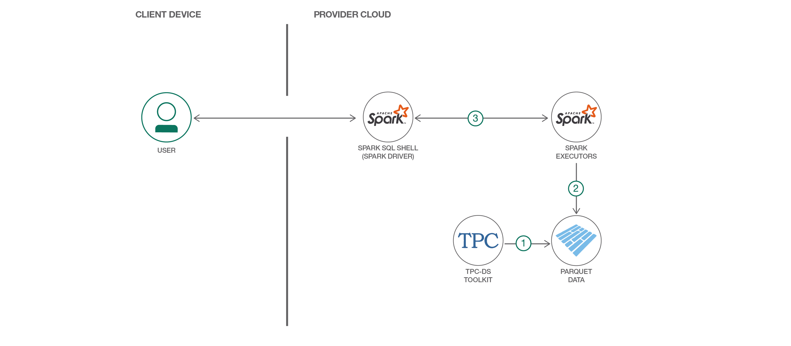
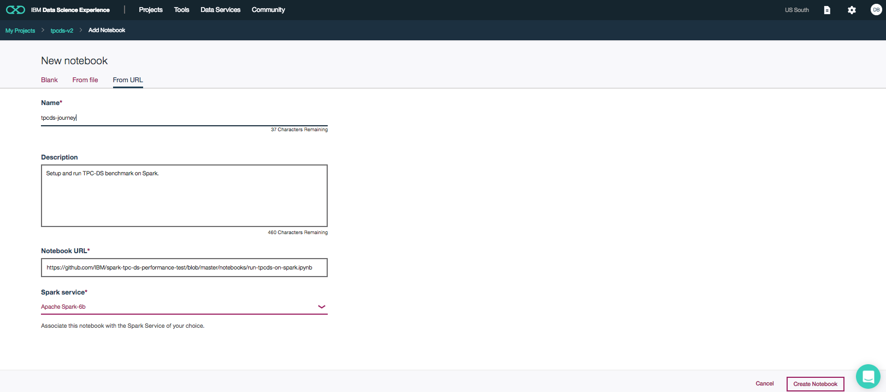

# Explore Spark SQL and its performance using TPC-DS workload

> Data Science Experience is now Watson Studio. Although some images in this code pattern may show the service as Data Science Experience, the steps and processes will still work.

[Apache Spark](https://spark.apache.org) is a popular distributed data processing engine that is built around speed, ease of use and sophisticated analytics, with APIs in Java, Scala, Python, R, and SQL. Like other data processing engines, Spark has a unified optimization engine that computes the optimal way to execute a workload with the main purpose of reducing the disk IO and CPU usage.   

We can evaluate and measure the performance of Spark SQL using the TPC-DS benchmark. [TPC-DS](http://www.tpc.org/tpcds) is a widely used industry standard decision support benchmark that is used to evaluate performance of data processing engines. Given that TPC-DS exercises some key data warehouse features, running TPC-DS successfully reflects the readiness of Spark in terms of addressing the need of a data warehouse application. Apache Spark v2.0 supports all the ninety-nine decision support queries that is part of this TPC-DS benchmark.

This Code Pattern is aimed at helping Spark developers quickly setup and run the TPC-DS benchmark in their own development setup. 

When the reader has completed this Code Pattern, they will understand the following:

* How to setup the TPC-DS toolkit 
* How to generate TPC-DS datasets at different scale factor 
* How to create Spark database artifacts 
* How to run TPC-DS benchmark queries on Spark in local mode and see the results 
* Things to consider when increasing the data scale and run against a spark cluster 



## Flow
* Commandline
  1. Compile the toolkit and generate the TPC-DS dataset by using the toolkit.
  2. Create the spark tables and generate the TPC-DS queries.
  3. Run the entire query set or a subset of queries and monitor the results.
* Notebook
  1. Create the spark tables with pre-generated dataset.
  2. Run the entire query set or individual query.
  3. View the query results or performance summary.
  4. View the performance graph. 

## Included components

* [Apache Spark](http://spark.apache.org/): An open-source, fast and general-purpose cluster computing system
* [Jupyter Notebook](http://jupyter.org/): An open-source web application that allows you to create and share documents that contain live code, equations, visualizations and explanatory text.

## Featured technologies

* [Data Science](https://medium.com/ibm-data-science-experience/): Systems and scientific methods to analyze
structured and unstructured data in order to extract knowledge and insights.
* [Artificial Intelligence](https://medium.com/ibm-data-science-experience): Artificial intelligence can be
applied to disparate solution spaces to deliver disruptive technologies.
* [Python](https://www.python.org/): Python is a programming language that lets you work more quickly
and integrate your systems more effectively.

# Steps

There are two modes of exercising this Code Pattern:
* Run locally using a simple interactive command line shell script.
* [Run using a Jupyter notebook in Watson Studio](#run-using-a-jupyter-notebook-in-watson-studio).

## Run locally
1. [Clone the repository](#1-clone-the-repo)
2. [Setup development tools](#2-setup-development-tools)
3. [Install Spark](#3-install-spark)
4. [Run the script](#4-run-the-script)

### 1. Clone the repository

Clone the `spark-tpc-ds-performance-test` repo locally. In a terminal, run:

``` 
$ git clone https://github.com/IBM/spark-tpc-ds-performance-test 
```

### 2. Setup development tools

Make sure the required development tools are installed in your platform. This Code Pattern is supported on Mac and Linux platforms only. Depending on your platform, run the following command to install the necessary development tools:

* **Ubuntu:**  
``` $ sudo apt-get install gcc make flex bison byacc git ```
* **CentOS/RHEL:**  
``` $ sudo yum install gcc make flex bison byacc git ```
* **MacOS:**  
``` $ xcode-select --install ```

### 3. Install Spark

To successfully run the TPC-DS tests, Spark must be installed and pre-configured to work with an [Apache Hive](https://hive.apache.org/) metastore. 

Perform 1 or more of the following options to ensure that Spark is installed and configured correctly. Once completed, modify ```bin/tpcdsenv.sh``` to set `SPARK_HOME` pointing to your Spark installation directory.

**Option 1** - If you already have Spark installed, complete the following steps to ensure your Spark version is properly configured:

```
$ cd $SPARK_HOME
$ bin/spark-shell

  // Enter the following command at the scala prompt
  scala> spark.conf
  scale> spark.conf.get("spark.sql.catalogImplementation")
  res5: String = hive
  scala> <ctrl-c>
```
*Note:* You must exit out of the spark-shell process or you will encounters errors when performing the TPC-DS tests.

If the prompt returns `String = hive`, then your installation is properly configured.

**Option 2** - If you don't have an installed Spark version, or your current installation is not properly configured, we suggest trying to pull down version 2.2.0 from the Spark [downloads page](https://spark.apache.org/downloads.html). This version should be configured to work with Apache Hive, but please run the test in the previous option to make sure. 

**Option 3** - The last option available is it to download and build it yourself. The first step is to clone the Spark repo:
```
$ git clone https://github.com/apache/spark.git
```
Then build it using these [instructions](https://spark.apache.org/docs/latest/building-spark.html). Please make sure to build Spark with Hive support by following the `Building With Hive and JDBC Support` section.
 
### 4. Run the script

*Note:* Verify that the `bin/tpcdsenv.sh` script has `SPARK_HOME` setup correctly.

Now that we have Spark setup and the TPC-DS scripts downloaded, we are ready to setup and start running the TPC-DS queries using the `bin/tpcdsspark.sh` utility script. This driver script will allow you to compile the TPC-DS toolkit to produce the data and the queries, and then run them to collect results.  

Perform the following steps to complete the execution of the script:

```
 $ cd spark-tpc-ds-performance-test
 $ bin/tpcdsspark.sh 

==============================================
TPC-DS On Spark Menu
----------------------------------------------
SETUP
 (1) Compile TPC-DS toolkit
 (2) Generate TPC-DS data with 1GB scale
 (3) Create spark tables
 (4) Generate TPC-DS queries
RUN
 (5) Run a subset of TPC-DS queries
 (6) Run All (99) TPC-DS Queries
CLEANUP
 (7) Cleanup toolkit
 (Q) Quit
----------------------------------------------
Please enter your choice followed by [ENTER]: 
```

#### Setup Option: "(1) - Compile TPC-DS toolkit"

The most recent toolkit can be downloaded from http://www.tpc.org/tpcds/. To make it easier for users, a toolkit based on `v2.4` is available locally in [src/toolkit](src/toolkit). If you download the newer toolkit from the official tpc-ds site, then make sure you overlay the code in src/toolkit before proceeding with this option.

This option compiles the toolkit to produce the data generation (dsdgen) and query generation (dsqgen) binaries. 

Below is the screen-shot when this option is chosen.

```
==============================================
TPC-DS On Spark Menu
----------------------------------------------
SETUP
 (1) Compile TPC-DS toolkit
 (2) Generate TPC-DS data with 1GB scale
 (3) Create spark tables
 (4) Generate TPC-DS queries
RUN
 (5) Run a subset of TPC-DS queries
 (6) Run All (99) TPC-DS Queries
CLEANUP
 (7) Cleanup toolkit
 (Q) Quit
----------------------------------------------
Please enter your choice followed by [ENTER]: 1
----------------------------------------------

INFO: Starting to compile..
INFO: make OS=MACOS
INFO: Completed building toolkit successfully..
Press any key to continue
```

#### Setup Option: "(2) - Generate TPC-DS data with 1GB scale"

This option uses the data generation binary produced in the previous step to generate the test data at a 1GB scale factor. The data is generated in the directory `TPCDS_GENDATA_DIR`. The default location of `TPCDS_GENDATA_DIR` is the local directory `gendata`. This can be changed by modifying the script `bin/tpcdsenv.sh`.  

Technically, this option can be used to generate data at a different scale. However, since this Code Pattern is targeted towards the developer environment, the scale has been fixed at 1GB. To modify this script to generate data at a different scale factor, see the discussion in the `scaling upto 100TB` section below. 

Below is the screenshot when this option is chosen.

```
==============================================
TPC-DS On Spark Menu
----------------------------------------------
SETUP
 (1) Compile TPC-DS toolkit
 (2) Generate TPC-DS data with 1GB scale
 (3) Create spark tables
 (4) Generate TPC-DS queries
RUN
 (5) Run a subset of TPC-DS queries
 (6) Run All (99) TPC-DS Queries
CLEANUP
 (7) Cleanup toolkit
 (Q) Quit
----------------------------------------------
Please enter your choice followed by [ENTER]: 2
----------------------------------------------

INFO: Starting to generate data. Will take a few minutes ...
INFO: Progress : [########################################] 100%
INFO: TPCDS data is generated successfully at spark-tpc-ds-performance-test/gendata
Press any key to continue
``` 

#### Setup Option: "(3) - Create Spark Tables"

After data generation has completed, this option creates the tables in the database name specified by `TPCDS_DBNAME` defined in `bin/tpcdsenv.sh`. The default name is `TPCDS` but can be changed if needed. 

The SQL statements to create the tables can be found in `src/ddl/create_tables.sql`, and are created in parquet format.  

Below is the screenshot when this option is chosen.

```
==============================================
TPC-DS On Spark Menu
----------------------------------------------
SETUP
 (1) Compile TPC-DS toolkit
 (2) Generate TPC-DS data with 1GB scale
 (3) Create spark tables
 (4) Generate TPC-DS queries
RUN
 (5) Run a subset of TPC-DS queries
 (6) Run All (99) TPC-DS Queries
CLEANUP
 (7) Cleanup toolkit
 (Q) Quit
----------------------------------------------
Please enter your choice followed by [ENTER]: 3
----------------------------------------------

INFO: Creating tables. Will take a few minutes ...
INFO: Progress : [########################################] 100%
INFO: Spark tables created successfully..
Press any key to continue
```

#### Setup Option: "(4) - Generate TPC-DS queries"

This option uses the query generation binary (dsqgen) produced in "option (1)" to generate the 99 TPC-DS queries. The queries are generated in the `TPCDS_GEN_QUERIES_DIR`, with a default location of `genqueries`. This can be changed my modifying the `bin/tpcdsenv.sh' script. 

Below is the screenshot when this option is chosen.

```
==============================================
TPC-DS On Spark Menu
----------------------------------------------
SETUP
 (1) Compile TPC-DS toolkit
 (2) Generate TPC-DS data with 1GB scale
 (3) Create spark tables
 (4) Generate TPC-DS queries
RUN
 (5) Run a subset of TPC-DS queries
 (6) Run All (99) TPC-DS Queries
CLEANUP
 (7) Cleanup toolkit
 (Q) Quit
----------------------------------------------
Please enter your choice followed by [ENTER]: 4
----------------------------------------------

INFO: Generating TPC-DS qualification queries.
INFO: Completed generating TPC-DS qualification queries.
Press any key to continue
```
 
#### Run Option: "(5) - Run a subset of TPC-DS queries"

A comma separated list of queries can be specified in this option. The result of each query in the supplied list is generated in `TPCDS_WORK_DIR`, with a default directory location of `work`. The format of the result file is `query<number>.res`. 

A summary file named `run_summary.txt` is also generated. It contains information about query number, execution time and number of rows returned. 

*Note:*  The query number is a two digit number, so for query 1 the results will be in `query01.res`.

*Note:*  If you are debugging and running queries using this option, make sure to save `run_summary.txt` after each of your runs.

```
==============================================
TPC-DS On Spark Menu
----------------------------------------------
SETUP
 (1) Compile TPC-DS toolkit
 (2) Generate TPC-DS data with 1GB scale
 (3) Create spark tables
 (4) Generate TPC-DS queries
RUN
 (5) Run a subset of TPC-DS queries
 (6) Run All (99) TPC-DS Queries
CLEANUP
 (7) Cleanup toolkit
 (Q) Quit
----------------------------------------------
Please enter your choice followed by [ENTER]: 5
----------------------------------------------

Enter a comma separated list of queries to run (ex: 1, 2), followed by [ENTER]:
1,2
INFO: Checking pre-reqs for running TPC-DS queries. May take a few seconds..
INFO: Checking pre-reqs for running TPC-DS queries is successful.
INFO: Running TPCDS queries. Will take a few minutes depending upon the number of queries specified.. 
INFO: Progress : [########################################] 100%
INFO: TPCDS queries ran successfully. Below are the result details
INFO: Individual result files: spark-tpc-ds-performance-test/work/query<number>.res
INFO: Summary file: spark-tpc-ds-performance-test/work/run_summary.txt
Press any key to continue
```

#### Run Option: "(6) - Run all (99) TPC-DS queries"

The only difference between this and option `(5)` is that all 99 TPC-DS queries are run instead of a subset.

*Note:* If you are running this on your laptop, it can take a few hours to run all  99 TPC-DS queries.

```
==============================================
TPC-DS On Spark Menu
----------------------------------------------
SETUP
 (1) Compile TPC-DS toolkit
 (2) Generate TPC-DS data with 1GB scale
 (3) Create spark tables
 (4) Generate TPC-DS queries
RUN
 (5) Run a subset of TPC-DS queries
 (6) Run All (99) TPC-DS Queries
CLEANUP
 (7) Cleanup toolkit
 (Q) Quit
----------------------------------------------
Please enter your choice followed by [ENTER]: 6
----------------------------------------------
INFO: Checking pre-reqs for running TPC-DS queries. May take a few seconds..
INFO: Checking pre-reqs for running TPC-DS queries is successful.
INFO: Running TPCDS queries. Will take a few minutes depending upon the number of queries specified.. 
INFO: Progress : [########################################] 100%
INFO: TPCDS queries ran successfully. Below are the result details
INFO: Individual result files: spark-tpc-ds-performance-test/work/query<number>.res
INFO: Summary file: spark-tpc-ds-performance-test/work/run_summary.txt
Press any key to continue
```

#### Cleanup option: "(7) - Cleanup toolkit"

This will clean up all of the files generated during option steps 1, 2, 3, and 4. If you use this option, make sure to run the setup steps ( 1, 2, 3, 4) before running queries using option 5 and 6.

#### Cleanup option: "(Q) - Quit"

This will exit the script.

## Run using a Jupyter notebook in Watson Studio

1. [Sign up for Watson Studio](#1-sign-up-for-watson-studio)
2. [Create the notebook](#2-create-the-notebook)
3. [Run the notebook](#3-run-the-notebook)
4. [Save and Share](#4-save-and-share)

### 1. Sign up for Watson Studio

Sign up for IBM's [Watson Studio](https://dataplatform.ibm.com). By creating a project in Watson Studio a free tier ``Object Storage`` service will be created in your IBM Cloud account.

> Note: When creating your Object Storage service, select the ``Free`` storage type in order to avoid having to pay an upgrade fee.

Take note of your service names as you will need to select them in the following steps.

### 2. Create the notebook

* In [Watson Studio](https://dataplatform.ibm.com), click on `Create notebook` to create a notebook.
* Create a project if necessary, provisioning an object storage service if required.
* In the `Assets` tab, select the `Create notebook` option.
* Select the `From URL` tab.
* Enter a name for the notebook.
* Optionally, enter a description for the notebook.
* Enter this Notebook URL: https://github.com/IBM/spark-tpc-ds-performance-test/blob/master/notebooks/run-tpcds-on-spark.ipynb
* Select the free Anaconda runtime.
* Click the `Create` button.



### 3. Run the notebook

When a notebook is executed, what is actually happening is that each code cell in
the notebook is executed, in order, from top to bottom.

Each code cell is selectable and is preceded by a tag in the left margin. The tag
format is `In [x]:`. Depending on the state of the notebook, the `x` can be:

* A blank, this indicates that the cell has never been executed.
* A number, this number represents the relative order this code step was executed.
* A `*`, this indicates that the cell is currently executing.

There are several ways to execute the code cells in your notebook:

* One cell at a time.
  * Select the cell, and then press the `Play` button in the toolbar.
* Batch mode, in sequential order.
  * From the `Cell` menu bar, there are several options available. For example, you
    can `Run All` cells in your notebook, or you can `Run All Below`, that will
    start executing from the first cell under the currently selected cell, and then
    continue executing all cells that follow.
* At a scheduled time.
  * Press the `Schedule` button located in the top right section of your notebook
    panel. Here you can schedule your notebook to be executed once at some future
    time, or repeatedly at your specified interval.

### 4. Save and Share

#### How to save your work:

Under the `File` menu, there are several ways to save your notebook:

* `Save` will simply save the current state of your notebook, without any version
  information.
* `Save Version` will save your current state of your notebook with a version tag
  that contains a date and time stamp. Up to 10 versions of your notebook can be
  saved, each one retrievable by selecting the `Revert To Version` menu item.

#### How to share your work:

You can share your notebook by selecting the “Share” button located in the top
right section of your notebook panel. The end result of this action will be a URL
link that will display a “read-only” version of your notebook. You have several
options to specify exactly what you want shared from your notebook:

* `Only text and output`: will remove all code cells from the notebook view.
* `All content excluding sensitive code cells`:  will remove any code cells
  that contain a *sensitive* tag. For example, `# @hidden_cell` is used to protect
  your dashDB credentials from being shared.
* `All content, including code`: displays the notebook as is.
* A variety of `download as` options are also available in the menu.

## Considerations while increasing the scale factor.
This Code Pattern walks us through the steps that need to be performed to run the TPC-DS 
benchmark with the qualification scale factor(1GB). Since this is a performance benchmark, typically 
we need to run the benchmark with varying scale factors to gauge the throughput of the underlying data
processing engine. In the section below, we will briefly touch on things to be considered while increasing
the data and running the workload against a production cluster.

* Generation of the data in larger scale factor:
  In order to increase the scale, please follow the section titled "Scaling and Database Population" in
  the [benchmark spec](http://www.tpc.org/tpc_documents_current_versions/pdf/tpc-ds_v2.2.0.pdf).
* Movement of data to the distributed file system:
  After generating the data, we need to copy or move them to the underlying distributed file system (typically hdfs)
  that your spark cluster is configured to work with.
* Creation of spark tables:
  Modify the create table ddl script to change the path to the location of the data after the above copy step.
  Additionally we may consider to partition the fact tables for better performance.
* We need to tune several spark configs to get optimal performance. Some of them are discussed in the following
  links.
     * [Troubleshooting and Tuning spark for heavy work loads](https://developer.ibm.com/hadoop/2016/07/18/troubleshooting-and-tuning-spark-for-heavy-workloads) 
     * [Scaling up to 100TB](https://developer.ibm.com/hadoop/2017/02/07/experiences-comparing-big-sql-and-spark-sql-at-100tb)

# Learn more

* **Data Analytics Code Patterns**: Enjoyed this Code Pattern? Check out our other [Data Analytics Code Patterns](https://developer.ibm.com/code/technologies/data-science/)
* **AI and Data Code Pattern Playlist**: Bookmark our [playlist](https://www.youtube.com/playlist?list=PLzUbsvIyrNfknNewObx5N7uGZ5FKH0Fde) with all of our Code Pattern videos
* **Watson Studio**: Master the art of data science with IBM's [Watson Studio](https://dataplatform.ibm.com/)
* **Spark on IBM Cloud**: Need a Spark cluster? Create up to 30 Spark executors on IBM Cloud with our [Spark service](https://console.bluemix.net/catalog/services/apache-spark)

# License
[Apache 2.0](LICENSE)
